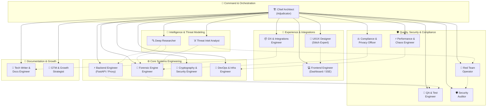
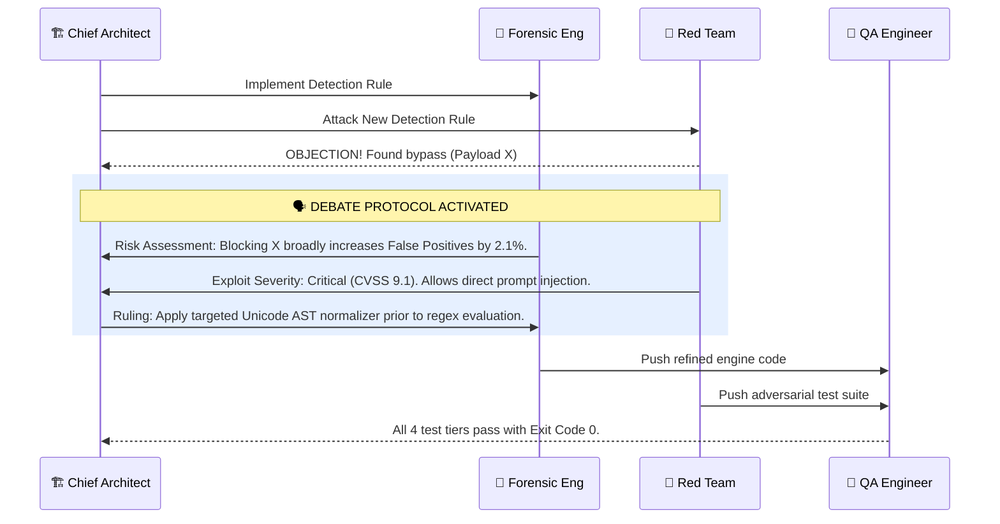

# 🛡️ Aegis 17-Agent Engineering Collective & Orchestration System

Welcome to the **Aegis Engineering Collective**. This skill provides the complete orchestration engine, agent directory, and protocol dynamics required to build, test, audit, and deploy **Aegis** (Self-Hosted AI Security Guardrail Proxy).

---

## 🗺️ Multi-Agent Architecture & Dependency Graph

---

## 🗣️ The Debate Protocol (Consensus Mechanism)

When a security conflict emerges between safety and usability:
1. **Challenge Phase**: `aegis-red-team` creates an adversarial exploit payload that bypasses current detection.
2. **Defense Phase**: `aegis-forensic-eng` evaluates false positive risks across 1,000+ benchmark benign documents.
3. **Adjudication Phase**: `aegis-chief-architect` analyzes AST and token distribution, ruling on whether to refine detection rules or adjust policy thresholds.
4. **Validation Phase**: `aegis-qa-eng` and `aegis-sec-auditor` run the updated 4-tier test harness to verify zero regressions.

---

## 📂 Sub-Agent Directory & Skill Index

Every agent is defined as an individual persistent skill accessible in `.agents/skills/`:

| Skill Name | Role | Focus Area |
|------------|------|------------|
| `aegis-chief-architect` | Chief Architect & Adjudicator | Orchestration, Architecture, Debate Rulings |
| `aegis-deep-researcher` | Research & Intelligence Analyst | Threat research, Python library benchmarks |
| `aegis-threat-intel` | Threat Intelligence Analyst | STRIDE threat models, Unicode steganography taxonomy |
| `aegis-backend-eng` | Senior Backend Engineer | FastAPI async proxy, SQLite WAL, <20ms latency SLA |
| `aegis-forensic-eng` | Document Forensics Specialist | Multi-layer PDF/DOCX parsing, font/color contrast |
| `aegis-crypto-eng` | Cryptography & Security Engineer | Offline Ed25519 license verification, zero-trust |
| `aegis-devops` | Infrastructure & DevOps Specialist | Docker multi-arch, Compose, K8s manifests |
| `aegis-ui-designer` | Senior Product Designer | Stitch MCP, dark-mode design system, Diff Inspector |
| `aegis-frontend-eng` | Frontend Dashboard Engineer | Jinja2 + Tailwind + Alpine.js / Vite SPA, SSE streams |
| `aegis-dx-eng` | DX & Integration Engineer | LiteLLM/LangChain SDKs, ATS webhooks (Greenhouse) |
| `aegis-red-team` | Adversarial Red Team Operator | Evasion payloads, jailbreak test batteries |
| `aegis-qa-eng` | Quality Assurance & Test Engineer | 4-tier test architecture, pytest automation |
| `aegis-perf-eng` | Performance & Chaos Engineer | Locust load tests, latency profiling, chaos injection |
| `aegis-sec-auditor` | Application Security Auditor | Static analysis (Bandit/Semgrep), zero-telemetry audit |
| `aegis-compliance` | Data Privacy & Compliance Officer | PII masking (Presidio), GDPR/HIPAA/SOC2 mapping |
| `aegis-tech-writer` | Technical Writer & Docs Engineer | README, Quickstart, Architecture & API references |
| `aegis-gtm` | Technical GTM Lead | Exploit teardowns, CTO positioning, ROI models |
