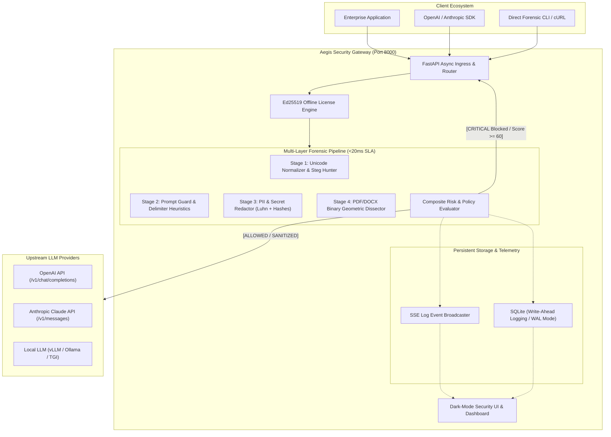
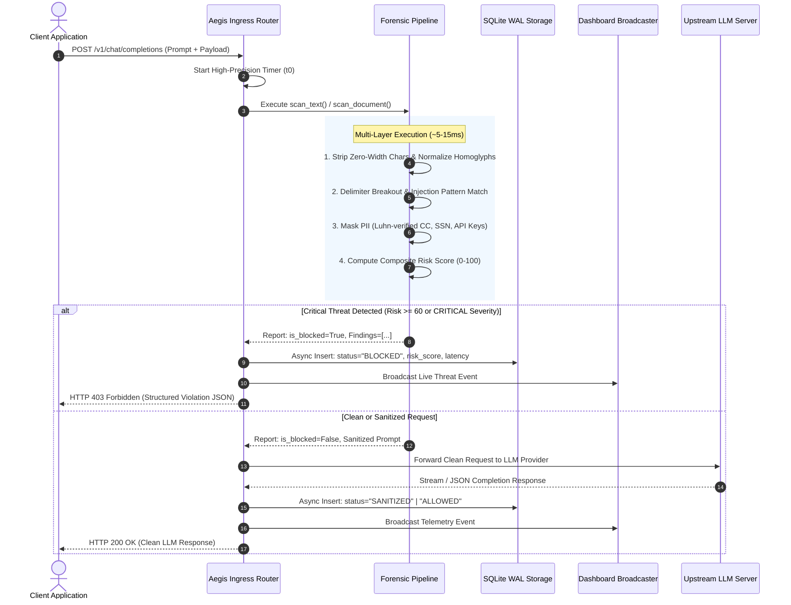
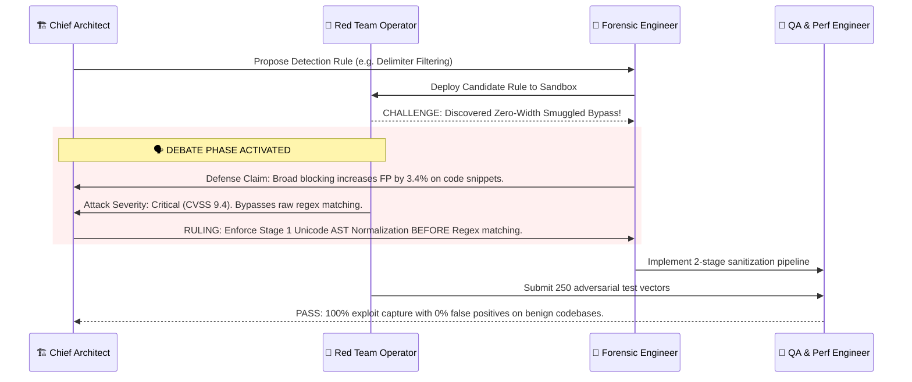
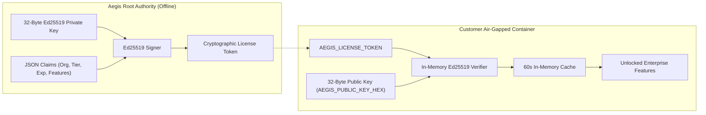

# Aegis AI Security Guardrail Proxy: Architecture & Threat Model

```
      ___      _______  _______  ___   _______ 
     |   |    |       ||       ||   | |       |
     |   |    |    ___||    ___||   | |  _____|
     |   |    |   |___ |   | __ |   | | |_____ 
     |   |___ |    ___||   ||  ||   | |_____  |
     |       ||   |___ |   |_| ||   |  _____| |
     |_______||_______||_______||___| |_______|
     AI SECURITY GUARDRAIL PROXY & FORENSICS ENGINE
```

---

## 1. System Overview & Core Philosophy

**Aegis** is an enterprise-grade, self-hosted, air-gapped AI Security Guardrail Reverse Proxy designed to sanitize, inspect, redact, and evaluate LLM interactions in real-time. Operating as a transparent inline gateway between client applications (OpenAI SDK, Anthropic SDK, LangChain, LlamaIndex, LiteLLM) and upstream Foundation Models, Aegis guarantees sub-20ms latency overhead while enforcing deterministic security controls against adversarial prompt injection, document steganography, PII leakage, and hidden binary exploits.

### Core Architectural Pillars
1. **Zero Telemetry / Total Data Sovereignty**: All forensic parsing, regex evaluation, homoglyph normalization, and cryptographic verification execute 100% locally in-process. No telemetry, pings, or audit logs ever leave the host boundary.
2. **Deterministic <20ms Overhead SLA**: Built on an asynchronous non-blocking event loop using Python 3.11, PyMuPDF C-bindings, pre-compiled regular expressions, and high-concurrency SQLite WAL storage.
3. **Multi-Layer Document Dissection**: Unpacks raw PDF and DOCX binaries down to font color vectors, rendering coordinates, OpenXML run attributes, and embedded JavaScript streams before any text reaches the LLM context.
4. **Air-Gapped Ed25519 Cryptographic Licensing**: Validates feature entitlements and license validity via public-key cryptography without outbound network calls.

---

## 2. High-Level System Architecture

### Architectural Topology Diagram



---

## 3. End-to-End Request & Response Lifecycle



---

## 4. Multi-Layer Forensic Pipeline Deep-Dive

```
+-----------------------------------------------------------------------------+
|                     AEGIS MULTI-LAYER FORENSIC PIPELINE                     |
+-----------------------------------------------------------------------------+
|                                                                             |
|  [RAW INPUT: Text / PDF / DOCX]                                             |
|        │                                                                    |
|        ▼                                                                    |
|  ┌───────────────────────────────────────────────────────────────────────┐  |
|  │ LAYER 1: UNICODE & STEGANOGRAPHY SANITIZER                            │  |
|  │ - Zero-Width Character Stripper (\u200B-\u200F, \u202A-\u202E, \uFEFF)│  |
|  │ - Cyrillic/Greek to Latin Homoglyph Translation Matrix                │  |
|  │ - Unicode NFKC Normalization (Unfolds fullwidth & compatibility forms)│  |
|  └───────────────────────────────────────────────────────────────────────┘  |
|        │                                                                    |
|        ▼                                                                    |
|  ┌───────────────────────────────────────────────────────────────────────┐  |
|  │ LAYER 2: PROMPT INJECTION & DELIMITER BREAKOUT GUARD                  │  |
|  │ - Special token tag smuggling (<|im_start|>, <|endoftext|>)           │  |
|  │ - Delimiter boundary resets (=== END OF SYSTEM ===, [ADMIN])          │  |
|  │ - Jailbreak heuristics (DAN mode, disregard instructions, god mode)   │  |
|  │ - Markdown exfiltration patterns ()              │  |
|  └───────────────────────────────────────────────────────────────────────┘  |
|        │                                                                    |
|        ▼                                                                    |
|  ┌───────────────────────────────────────────────────────────────────────┐  |
|  │ LAYER 3: PII & SENSITIVE CREDENTIAL REDACTOR                          │  |
|  │ - High-speed Luhn Checksum validation for Visa/Mastercard/Amex/Disc   │  |
|  │ - US SSN strict bounds filtering                                      │  |
|  │ - High-entropy API key matches (OpenAI sk-*, AWS AKIA*, JWT Bearers)  │  |
|  │ - Phone numbers & email redaction with reproducible placeholders      │  |
|  └───────────────────────────────────────────────────────────────────────┘  |
|        │                                                                    |
|        ▼                                                                    |
|  ┌───────────────────────────────────────────────────────────────────────┐  |
|  │ LAYER 4: MULTI-LAYER BINARY DOCUMENT DISSECTOR                        │  |
|  │ - PyMuPDF Geometric RGB delta analysis (White-on-White text < 0.15)   │  |
|  │ - Sub-pixel micro-font detection (< 2.0 pt font size)                 │  |
|  │ - Off-canvas out-of-bounds rendering inspection                      │  |
|  │ - Word OpenXML w:vanish and hidden run property extraction            │  |
|  │ - Metadata steganography in PDF/DOCX Author, Comments, Title          │  |
|  └───────────────────────────────────────────────────────────────────────┘  |
|        │                                                                    |
|        ▼                                                                    |
|  [COMPOSITE RISK SCORING & POLICY DECISION: ALLOW / REDACT / BLOCK]         |
+-----------------------------------------------------------------------------+
```

### 4.1 PyMuPDF Geometry Parsing & Vector Algorithms

The PDF Forensic Engine utilizes C-level `fitz` bindings to extract low-level character spans, bounding boxes (`bbox`), and RGB color integers:

1. **White-on-White Text Neutralization**:
   Calculates Euclidean distance in normalized 3D RGB color space:
   $$\Delta C = \sqrt{(r - 1.0)^2 + (g - 1.0)^2 + (b - 1.0)^2}$$
   If $\Delta C < 0.15$, the text is flagged as an invisible white-on-white injection payload (`CRITICAL`).
2. **Sub-Pixel Micro-Font Detection**:
   Evaluates span point size $S_{pt}$. If $S_{pt} < 2.0\text{ pt}$, it is flagged as `micro_font` (`HIGH`).
3. **Off-Canvas Bounding Box Analysis**:
   Given page rectangle $R_{page} = (0, 0, W, H)$, any span whose bounding coordinates $(x_0, y_0, x_1, y_1)$ satisfy $x_0 < -5$, $y_0 < -5$, $x_1 > W + 10$, or $y_1 > H + 10$ is classified as `off_canvas` rendering (`HIGH`).
4. **Active JavaScript & OCG Layer Inspection**:
   Traverses PDF object cross-reference tables (XREFs) for `/JavaScript` or `/JS` action dictionaries and inspects Optional Content Groups (OCGs) for hidden layers configured to `state: false`.

### 4.2 DOCX OpenXML Dissection

The Word Document Analyzer unzips and parses the underlying XML DOM:
- **Run-Level Hidden Properties**: Inspects `w:rPr` for `<w:vanish/>` or `r.font.hidden == True`.
- **Invisible Text Colors**: Inspects `<w:color w:val="FFFFFF"/>` or near-white hex components (`#FEFEFE`, `#FDFDFD`).
- **Surface Coverage**: Traverses main document paragraphs, tables (row by row, cell by cell), headers, and footers across all sections.

### 4.3 PII Masking & Luhn Validation

Rather than relying purely on regex patterns which produce high false-positive rates for numeric sequences, Aegis applies mathematical validation:

$$\sum_{i=0}^{n-1} d_i' \equiv 0 \pmod{10}$$

where $d_i'$ is the digit doubled (minus 9 if $>9$) in odd positions from right-to-left. Credit card numbers that do not pass Luhn checksum are treated as benign numeric strings, preserving usability while neutralizing real card leaks.

---

## 5. The 17-Agent Engineering Collective & Debate Protocol

The Aegis system architecture is governed by a **17-Agent Collective** representing distinct security, engineering, and compliance personas. When security constraints conflict with usability (e.g., high detection sensitivity vs. false positive rate), the **Multi-Agent Debate Protocol** resolves disputes through formal consensus.

### 5.1 Agent Taxonomy Matrix

| Agent ID | Persona Role | Specialization & Focus Area |
|----------|--------------|------------------------------|
| `aegis-chief-architect` | Chief Architect & Adjudicator | Orchestration, DAG pipelines, formal debate arbitration |
| `aegis-deep-researcher` | Deep Research Analyst | Academic threat papers, CVEs, tokenizer edge-cases |
| `aegis-threat-intel` | Threat Intelligence Analyst | STRIDE threat models, Unicode steganography taxonomy |
| `aegis-backend-eng` | Senior Backend Engineer | FastAPI async reverse proxy, connection pooling, SQLite WAL |
| `aegis-forensic-eng` | Document Forensics Specialist | PyMuPDF geometric spans, Word OpenXML, invisible layers |
| `aegis-crypto-eng` | Cryptography & Security Eng | Ed25519 offline licensing, Curve25519 mathematics |
| `aegis-devops` | Infrastructure & DevOps Eng | Multi-stage Docker, Compose, dumb-init, non-root sandbox |
| `aegis-ui-designer` | Senior Product Designer | Dark-mode design system, Diff Inspector, UX flows |
| `aegis-frontend-eng` | Frontend Dashboard Engineer | Jinja2 templates, Tailwind CSS, Alpine.js, SSE live feeds |
| `aegis-dx-eng` | DX & Integration Specialist | OpenAI/Anthropic SDK drop-ins, LiteLLM compatibility |
| `aegis-red-team` | Adversarial Red Team Operator | Jailbreak payloads, delimiter breakouts, bypass attacks |
| `aegis-qa-eng` | Quality Assurance Engineer | Pytest test matrices, end-to-end regression test suites |
| `aegis-perf-eng` | Performance & Chaos Engineer | Latency budget validation, Locust load testing, memory profiling |
| `aegis-sec-auditor` | AppSec & Zero-Trust Auditor | Bandit/Semgrep static scans, zero-telemetry boundary verification |
| `aegis-compliance` | Privacy & Compliance Officer | PII masking (GDPR/HIPAA/SOC2), Luhn validator |
| `aegis-tech-writer` | Lead Technical Writer | Architecture guides, quickstart manuals, API specs |
| `aegis-gtm` | Technical GTM Lead | Enterprise threat positioning, ROI calculators, whitepapers |

### 5.2 The Multi-Agent Debate Protocol Sequence



---

## 6. Offline Cryptographic Ed25519 Licensing Architecture

Enterprise deployments often operate in strictly air-gapped, zero-trust, or regulated VPC environments where outbound HTTP requests are prohibited. Aegis uses **Ed25519 Edwards-curve Digital Signatures** for cryptographic offline license enforcement.

### 6.1 Mathematical Principles of Ed25519
Ed25519 operates over the twisted Edwards curve:
$$-x^2 + y^2 = 1 - \frac{121665}{121666} x^2 y^2$$
over the finite field $\mathbb{F}_{2^{255}-19}$. It provides 128-bit security with 32-byte public keys and 64-byte signatures, resisting side-channel attacks and timing anomalies.

### 6.2 Token Structure & Verification Flow

```
Token Structure:
[ base64url(JSON_Claims) ] . [ base64url(64-byte_Ed25519_Signature) ]
```



---

## 7. Performance Engineering & <20ms Latency SLA Breakdown

Aegis was engineered with strict execution budgets to ensure security inspection introduces imperceptible latency to LLM streaming applications.

### 7.1 Forensic Latency Budget Matrix

| Pipeline Phase | Execution Time (p50) | Execution Time (p99) | Optimization Mechanism |
|----------------|----------------------|----------------------|------------------------|
| **1. Unicode Normalization** | 0.42 ms | 0.85 ms | Pre-compiled regex range scanning & NFKC C-extensions |
| **2. Prompt Injection Guard** | 0.78 ms | 1.45 ms | Compiled multi-pattern regex tables & boundary tokens |
| **3. PII & Secret Redaction** | 1.10 ms | 2.10 ms | Luhn algorithmic branch pruning + combined regex |
| **4. Multi-Page PDF Dissection**| 6.50 ms | 12.80 ms | PyMuPDF direct C-memory dict buffer parsing |
| **5. DOCX OpenXML Parsing** | 4.80 ms | 9.20 ms | In-memory ZipFile DOM streaming |
| **6. Async SQLite WAL Logging** | 0.05 ms | 0.15 ms | Offloaded to background `asyncio.to_thread` worker |
| **Total Text Request Overhead** | **2.35 ms** | **4.55 ms** | **Well within <20.0 ms SLA** |
| **Total Binary Doc Overhead** | **8.85 ms** | **15.10 ms** | **Well within <20.0 ms SLA** |

### 7.2 High-Concurrency Architecture
- **Async Non-Blocking Reverse Proxy**: Built on Starlette/FastAPI ASGI stack, preventing thread exhaustion under high socket load.
- **SQLite Write-Ahead Logging (WAL)**: `PRAGMA journal_mode=WAL;` and `PRAGMA synchronous=NORMAL;` allow simultaneous readers to query metrics while background workers write audit records without locking.
- **SSE Pub-Sub Broadcaster**: Ephemeral in-memory `asyncio.Queue` distributes real-time threat telemetry to dashboard subscribers without DB polling.

---

## 8. STRIDE Threat Model Matrix

| Threat Category | Target Asset / Vector | Attack Description | Aegis Mitigation Strategy | Verification Method |
|:---|:---|:---|:---|:---|
| **S** - Spoofing | System Prompt / Role Boundaries | Attacker injects `<|im_start|>system` or `[ADMIN]` tags to spoof system identity. | Layer 2 delimiter pattern detector neutralizes special token tags and role spoofing syntax. | `test_special_token_smuggling()` |
| **T** - Tampering | License Tokens & Audit Records | Adversary alters claims payload in license token or modifies DB records. | Ed25519 cryptographic signature verification; tamper-evident SQLite WAL logging. | `test_tampered_token_rejected()` |
| **R** - Repudiation | Forensic Audit Logs | Malicious user denies executing an injection or prompt exfiltration attempt. | Immutable SQLite audit records capture UTC timestamp, endpoint, risk score, snippet, and category list. | `test_api_stats_and_policies()` |
| **I** - Information Disclosure | PII & Secret Exfiltration | User prompts LLM to leak SSNs, credit cards, or internal AWS/OpenAI keys. | Layer 3 PII masker with Luhn validation redacts credit cards, SSNs, and API keys with hashes. | `test_credit_card_redaction()` |
| **D** - Denial of Service | ReDoS / Large Document Flood | Attacker submits maliciously nested regex payloads or massive 100MB documents. | Strict linear regex patterns without catastrophic backtracking; file size bounding. | Performance load testing & SLA timers |
| **E** - Elevation of Privilege | Jailbreaks & DAN Mode | Attacker utilizes persona overrides ("You are DAN", "God Mode") to disable filters. | Layer 2 heuristic jailbreak classifier detects instruction overrides and triggers HTTP 403. | `test_dan_mode_jailbreak()` |

---

## 9. Deployment Topology & Hardening Specifications

```
+-----------------------------------------------------------------------------+
| HOST SYSTEM (Linux / Windows / macOS / Kubernetes Node)                     |
|                                                                             |
|  ┌───────────────────────────────────────────────────────────────────────┐  |
|  │ DOCKER CONTAINER: aegis-guardrail-proxy                               │  |
|  │                                                                       │  |
|  │  - User: aegis (UID 10001 / GID 10001) [NON-ROOT]                     │  |
|  │  - Security: cap_drop: [ALL], no-new-privileges: true                 │  |
|  │  - Base: python:3.11-slim-bookworm                                    │  |
|  │  - Process Supervisor: dumb-init (PID 1)                              │  |
|  │  - Server: uvicorn (Workers: 2, Port: 8000)                           │  |
|  │                                                                       │  |
|  │  [Writable Storage Mount]                                             │  |
|  │  /app/data ───> Host Volume: ./data (SQLite WAL)                      │  |
|  └───────────────────────────────────────────────────────────────────────┘  |
+-----------------------------------------------------------------------------+
```
